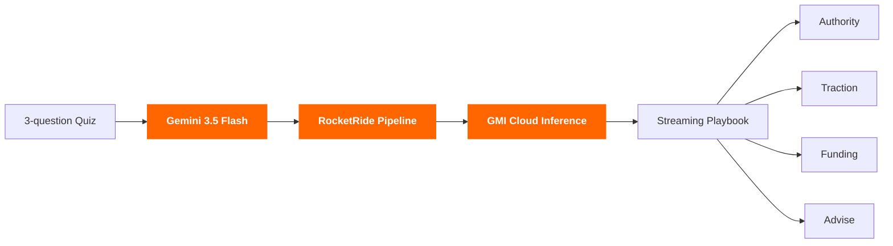

# vc.me

> Turn first-time founders into fundable ones — in 60 seconds.

## The problem

A first-time founder without a network, paying customers, or VC relationships is stuck in three places at once. They don't know what to do next on **authority**, on **traction**, or on **fundraising** — and they're embarrassed to ask the basic questions.

There's no shortage of advice on the internet. There's no playbook for *their* startup, today.

## What vc.me does

Answer three questions about your startup. We generate a complete founder playbook across **four dimensions**, streamed live so you watch it come together:

| Tab | What you get |
|---|---|
| **Authority** | A diagnosis of the one conversation you should own. A ready-to-post LinkedIn post (with image). A grouped list of **25 podcasts, YouTube channels, and newsletters** to pitch — each with a custom-written pitch you can copy. |
| **Traction** | **18 hand-curated events** in SF, NY, LA, and Miami, scored for AI engineer / agent builder density. Each row tells you *why this one* and links to RSVP. |
| **Funding** | **25 VCs matched to your thesis.** Click any row to open a Gmail-style draft — subject + body personalized to the partner and the firm's published thesis. Send in one click. |
| **Advise** | **Three 90-second video clips** tailored to your story. Two are pre-generated; the third you can ask Sarah to film on demand. |

## How it works

Three technologies are stacked to make the live generation feel real.



| Layer | Role |
|---|---|
| **Gemini 3.5 Flash** | Drafts every piece of generated copy — diagnosis, LinkedIn post, 25 personalized cold emails, video scripts. Chosen for sub-second latency on short prompts. |
| **RocketRide Pipeline** | Orchestrates the multi-stage flow (quiz → match → draft → render). Each playbook tab is a pipeline that can fan out in parallel and stream partial results back to the UI. |
| **GMI Cloud Inference** | Runs Sarah's scoring + matching layer — founder thesis ↔ VCs, events, podcasts — at low cost per match so the demo can score 80+ entities live without breaking the bank. |

## Run it

```bash
npm install
npm run dev
# open http://localhost:3000
```

`/` is a headerless hero with the 3-question voice quiz CTA. `/quiz` is the typeform-style interview. `/results` is the live-generating playbook with all four tabs unlocked.

### Optional backend

```bash
GMI_API_KEY=your_gmi_key python3 scripts/vcme_api.py
VITE_VCME_API_URL=http://127.0.0.1:8787 npm run dev
```

Without the backend, the app uses a local fallback so the demo always works.

## Stack

React 19 · Vite · react-router · TypeScript · Source Serif 4 + Inter · Light-mode YC palette (cream `#FBF7F0`, orange `#FF6600`).
